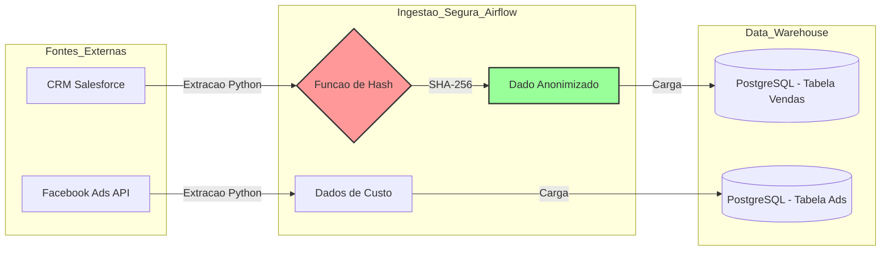

# Boti-Franquias 360: Pipeline Seguro de Analytics

-red?style=for-the-badge&logo=security)

> **Business Case:** Pipeline ELT focado na ingestão de dados de marketing e vendas de franqueados, com anonimização de dados sensíveis (PII) na origem para conformidade com a LGPD.

---

## Sobre o Projeto

Este projeto simula um cenário real de **Analytics Engineering no varejo**: integrar dados de CRM e plataformas de Ads para medir a **rentabilidade de franqueados**, garantindo privacidade e segurança desde a origem.

### Desafio

Cruzar dados de clientes para métricas de recorrência (ex.: LTV) sem jamais expor informações pessoais.

### Solução

Um pipeline em Airflow que aplica **hashing SHA-256 na extração**, eliminando dados sensíveis antes mesmo da persistência no Data Warehouse.

---

## Arquitetura de Segurança (Privacy by Design)

O fluxo foi desenhado com o princípio de **não armazenar PII em nenhum momento**.

## Tech Stack
 • Orquestração: Apache Airflow 2.9 (Containerizado)
 • Linguagem: Python 3.12 (Pandas, Hashlib)
 • Banco de Dados: PostgreSQL 13
 • Segurança: Algoritmo SHA-256 para mascaramento de PII
 • Infraestrutura: Docker & Docker Compose

## Detalhes da Implementação
No DAG boti_franquias_etl, a execução está dividida em três grandes blocos:
1. Mock de APIs
Simulação de retornos JSON do CRM e Ads.

2. Anonimização em Memória
• Recebe dados brutos (ex.: email_cliente).
• Aplica hashlib.sha256().
• Remove o valor original da memória.
• Persiste somente o hash (email_hash).

3. Carga
Dados anonimizados são enviados para tabelas PostgreSQL prontas para BI, dbt ou análises avançadas.

## Evidências de Execução
1. Fluxo no Airflow
DAG executada com sucesso, com logs exibindo o processo de anonimização.

2. Validação no Banco
Consulta SQL mostrando que colunas de PII foram substituídas por hashes irreversíveis.

## Como Executar
# 1. Clone o repositório
git clone https://github.com/ricardoribs/boti-franquias-security.git
cd boti-franquias-security

# 2. Suba o ambiente
docker-compose up -d --build

Acesse o Airflow
• URL: http://localhost:8080
• User/Pass: airflow

